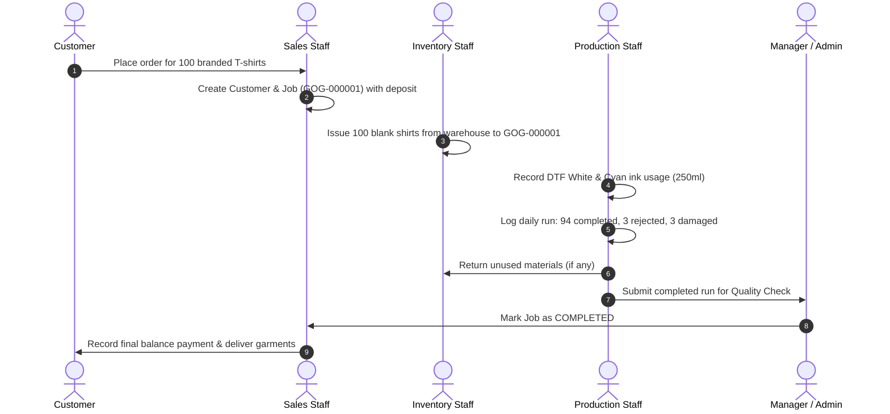

# GOG Management System

A full-stack, enterprise-grade production, inventory, and order management platform built specifically for **GOG Printing & Branding Ltd**.

---

## Table of Contents
1. [Overview & Key Features](#overview--key-features)
2. [Technology Stack](#technology-stack)
3. [User Roles & Permissions Matrix](#user-roles--permissions-matrix)
4. [Demo Accounts & Credentials](#demo-accounts--credentials)
5. [Core Modules & Digital Workflow](#core-modules--digital-workflow)
6. [Business Rules & Mathematical Calculations](#business-rules--mathematical-calculations)
7. [Getting Started & Local Setup](#getting-started--local-setup)
8. [Automated Testing](#automated-testing)
9. [Docker & Production Deployment](#docker--production-deployment)
10. [REST API Endpoints Reference](#rest-api-endpoints-reference)
11. [Design Decisions & Architecture Rationale](#design-decisions--architecture-rationale)

---

## Overview & Key Features

GOG specializes in customized garment branding (T-shirts, polos, hoodies), promotional items (mugs, caps), and large format printing (banners, vinyl, stickers) using methods such as **DTF**, **Screen Printing**, **Sublimation**, and **Embroidery**.

The system replaces manual spreadsheets with a relational digital ledger that delivers:
- **Zero-Friction Role-Based Access Control** across 5 distinct job functions.
- **Atomic Stock Ledger Engine**: Guarantees that every inventory mutation generates an immutable stock transaction audit log.
- **Daily Production Floor Terminal**: Tablet-friendly logging for machine operators, scrap tracking, and overrun guards.
- **Ink Tracking & Wastage**: Direct calculation of consumption and purge/cleaning wastage per print run.
- **Material Issue & Return Reconciliation**: Tracks planned vs. issued vs. net-consumed blank items with live variance calculation.
- **Financial & Profitability Engine**: Calculates gross profit margins per job by factoring blank apparel costs, ink usage, consumables, labour, packaging, and delivery.

---

## Technology Stack

- **Framework**: Next.js 14+ (App Router) with React 18, TypeScript
- **Styling**: Tailwind CSS with custom glassmorphism, responsive data tables, dark-slate theme
- **Database & ORM**: Prisma ORM with MongoDB (local replica set `rs0` or MongoDB Atlas cloud)
- **Authentication**: Role-based JWT session cookies with secure hashing via `bcryptjs`
- **Validation**: Zod schema validation on both client and server API route handlers
- **Icons & Visuals**: Lucide React
- **Testing**: Vitest with unit tests and 8-step end-to-end integration tests

---

## User Roles & Permissions Matrix

| Feature / Action | Administrator | Manager | Sales / Front Desk | Production Floor | Inventory Store |
| :--- | :---: | :---: | :---: | :---: | :---: |
| **Executive Dashboard** | Full | Full | Sales & Job KPIs | Production KPIs | Stock & Reorder KPIs |
| **Customer Management** | Full | Full | Create, Edit, View | Basic view | Basic view |
| **Jobs & Quotations** | Full | Full | Create, Edit, Status | View assigned jobs | View material demands |
| **Financial Margins** | Full | Full | Pricing, Deposit, Bal | ❌ Hidden | ❌ Hidden |
| **Daily Production Log** | Full | Override approval | View status | Fast log & scrap | View status |
| **Inventory Catalog** | Full | Full | View stock | View stock | Create, Edit, Counts |
| **Stock Adjustments** | Full | Approve adjustments | ❌ No access | ❌ No access | Create with reason |
| **Material Issue/Return** | Full | Full | View | View | Issue & return stock |
| **Ink Usage & Purge** | Full | Full | View | Log usage & purge | View stock levels |
| **Suppliers & Purchases**| Full | Full | ❌ No access | ❌ No access | Create & receive POs |
| **Reports Hub** | All 6 Reports | All 6 Reports | Sales & Job reports | Production reports | Inventory & Usage |
| **User Administration** | Full | View users | ❌ No access | ❌ No access | ❌ No access |

---

## Demo Accounts & Credentials

The system includes pre-seeded accounts for all 5 roles:

| Role | Email | Password | Primary Mission |
| :--- | :--- | :--- | :--- |
| **Administrator** | `admin@gog.com` | `Admin@123` | System config, user permissions, all audits |
| **Manager** | `manager@gog.com` | `Manager@123` | Production overrides, financial reports, stock approval |
| **Sales / Front Desk** | `sales@gog.com` | `Sales@123` | Customer onboarding, job quotes, receiving deposits |
| **Production Floor** | `production@gog.com` | `Production@123` | Daily shift logs, scrap records, ink consumption |
| **Inventory Store** | `inventory@gog.com` | `Inventory@123` | Material issues to jobs, returns, receiving POs |

> [!TIP]
> **1-Click Demo Switcher**: While logged into the app, click the **Role** dropdown in the top header to instantaneously test permissions as any of the 5 roles without logging out!

---

## Core Modules & Digital Workflow



---

## Business Rules & Mathematical Calculations

1. **Atomic Stock Ledger**:
   $$\text{Current Stock} = \text{Opening} + \text{Purchases Received} + \text{Returns} - \text{Issues} - \text{Sales} - \text{Damages} - \text{Wastage} \pm \text{Adjustments}$$
   Direct modification of `currentStock` is prohibited; every change must produce a `StockTransaction`.

2. **Pending Quantity Formula**:
   $$\text{Quantity Pending} = \text{Quantity Ordered} - (\text{Quantity Completed} + \text{Quantity Rejected} + \text{Quantity Cancelled})$$

3. **Production Shift Remaining Calculation**:
   $$\text{Quantity Remaining} = \text{Quantity Planned} - (\text{Quantity Completed} + \text{Quantity Rejected} + \text{Quantity Damaged})$$

4. **Production Overrun Protection**:
   Attempting to log $\text{Completed} + \text{Rejected} > \text{Ordered Quantity}$ triggers a safety barrier requiring Manager/Administrator approval before saving.

5. **Ink Consumption Calculation**:
   $$\text{Total Ink Consumption} = \text{Production Ink Used} + \text{Test Print Ink} + \text{Purged / Spilled Ink}$$

6. **Material Variance Equation**:
   $$\text{Materials Consumed} = \text{Materials Issued} - \text{Materials Returned}$$
   $$\text{Variance} = \text{Materials Planned} - \text{Materials Consumed}$$

7. **Job Profitability Formula**:
   $$\text{Estimated Profit} = \text{Revenue} - (\text{Blank Cost} + \text{Ink Cost} + \text{Consumables} + \text{Labour} + \text{Packaging} + \text{Delivery})$$

---

## Getting Started & Local Setup

### Prerequisites
- Node.js 18+ or 20+
- npm 9+ or 10+

### Step-by-Step Installation

1. **Clone or Navigate to the Workspace Directory**:
   ```bash
   cd "c:/Users/jrubagumya/OneDrive - Old Mutual Africa Regions/Desktop/GOG Management System"
   ```

2. **Install Dependencies**:
   ```bash
   npm install
   ```

3. **Start MongoDB**:
   - **Local MongoDB**: Run `start-mongodb.bat` (or start `mongod` on port 27017 with `--replSet rs0`).
   - If running for the first time, initialize the replica set:
     ```bash
     npm run replica:init
     ```
   - **MongoDB Atlas**: Configure your Atlas connection string in `.env`.

4. **Initialize the Database**:
   ```bash
   npx prisma db push
   ```

5. **Seed Demo Data & User Roles**:
   ```bash
   npm run seed
   ```

6. **Start the Development Server**:
   ```bash
   npm run dev
   ```
   Open [http://localhost:3000](http://localhost:3000) in your web browser.

---

## Automated Testing

Run the Vitest test suite covering mathematical calculations and the end-to-end 8-step production lifecycle:

```bash
npm test
```

Expected output:
```
 ✓ tests/calculations.test.ts (7 tests)
 ✓ tests/e2e-workflow.test.ts (8 tests)

 Test Files  2 passed (2)
      Tests  15 passed (15)
```

---

## Docker & Production Deployment

A production-ready `Dockerfile` and `docker-compose.yml` with PostgreSQL configuration is included.

To deploy via Docker:
```bash
docker-compose up --build -d
```

---

## REST API Endpoints Reference

| Route | Methods | Description |
| :--- | :--- | :--- |
| `/api/auth/login` | `POST` | User authentication & JWT cookie issuance |
| `/api/auth/me` | `GET`, `POST` | Session info and quick-role switching |
| `/api/auth/logout` | `POST` | Session termination |
| `/api/customers` | `GET`, `POST` | Customer listing, balance aggregation & creation |
| `/api/customers/[id]` | `GET`, `PUT`, `DELETE` | Customer profile, update, and soft archive |
| `/api/jobs` | `GET`, `POST` | Multi-line item job creation & ticket directory |
| `/api/jobs/[id]` | `GET`, `PUT` | Full ticket details & status transitions |
| `/api/production` | `GET`, `POST` | Daily production runs with overrun guards |
| `/api/inventory` | `GET`, `POST` | Item catalog, T-shirt matrix & valuation |
| `/api/inventory/transactions` | `GET`, `POST` | Immutable stock movement ledger & adjustments |
| `/api/ink-usage` | `GET`, `POST` | Ink consumption tracking & purge waste logs |
| `/api/materials/issue` | `POST` | Issues blank apparel from inventory to job |
| `/api/materials/return` | `POST` | Returns unused blank materials to inventory |
| `/api/materials` | `GET` | Material variance & consumption summaries |
| `/api/suppliers` | `GET`, `POST` | Vendor contact directory |
| `/api/purchases` | `GET`, `POST` | Purchase receiving & automated inventory updates |
| `/api/payments` | `GET`, `POST` | Job payments & balance reconciliation |
| `/api/reports` | `GET` | 6 downloadable reports with CSV export & print |
| `/api/dashboard` | `GET` | Real-time operational KPIs & active alerts |
| `/api/users` | `GET`, `POST` | Staff account provisioning (Admin only) |
| `/api/settings` | `GET`, `PUT` | Business configuration & hourly labour rates |

---

## Design Decisions & Architecture Rationale

1. **SQLite for Instant Local Execution + PostgreSQL Production Compatibility**:
   Prisma abstracts database drivers. SQLite enables instant, zero-dependency development on Windows with file persistence (`dev.db`), while PostgreSQL is ready via Docker for cloud deployments.
2. **Atomic In-Memory & Database Transactions**:
   All stock mutations and production run submissions use `prisma.$transaction` to guarantee that quantities, financial deposits, and audit entries commit atomically.
3. **Role-Based Financial Data Obfuscation**:
   Production and inventory users on the shop floor have revenue, unit prices, and margins masked at both the API and UI levels to protect business margins.
4. **Fast Tablet-Optimized Daily Entry Form**:
   The production logging interface was engineered for workshop operators wearing gloves or working near heat presses with large touch targets, auto-fill buttons, and live calculation cards.
